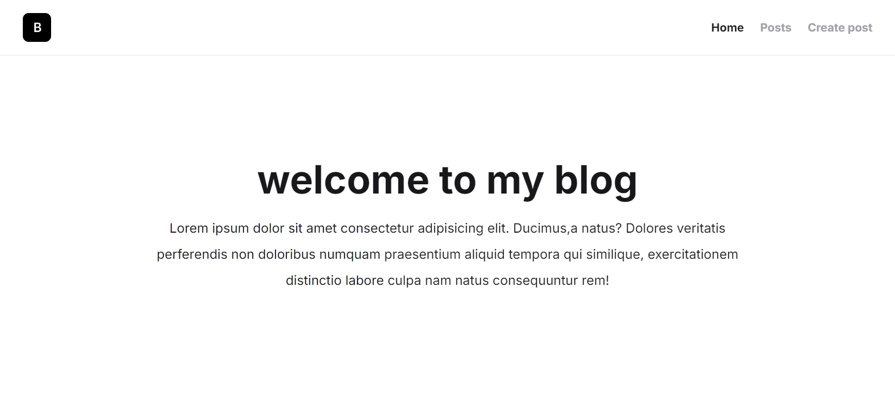

# 使用next.js搭建一个免费的博客网站
你好！这是我用Next.js搭建的第一个项目[blogs💡](https://blogs-sable-zeta.vercel.app)，访问🪜[原作者视频地址](https://www.youtube.com/watch?v=y7JCnfbETPs)


>完成项目的过程中，我掌握了 `react`，`next.js`，`typeScript`，`tailwindcss`，[`prisma(数据库)`](https://www.prisma.io/docs/orm/more/help-and-troubleshooting/help-articles/nextjs-prisma-client-dev-practices) [`kinde(登录授权)`](https://kinde.com)，[`vercel(部署)`](https://vercel.com/)的部分知识🍻
>搭建部署过程我梳理并总结成了文档，希望你能喜欢 ~

## 一. 搭建过程
### 1. 创建并初始化项目
##### 1.1 创建一个`my-blogs`的文件夹，在`my-blogs`中创建next.js应用：
```
npx create-next-app@14.2.3 . 
```
或最新版本。
```
npx create-next-app@latest .
```
选择的一些配置。
```
√ Would you like to use TypeScript? ...  Yes
√ Would you like to use ESLint? ...  Yes
√ Would you like to use Tailwind CSS? ... Yes
√ Would you like to use `src/` directory? ...  Yes
√ Would you like to use App Router? (recommended) ...  Yes
√ Would you like to customize the default import alias (@/*)? ... No
```
##### 1.2 初始化部分文件：
```tsx
// src\app\page.tsx 
export default function Page() {
  return (
    <div>
      Page
    </div>
  )
}
```

```css
/* src\app\globals.css */
@tailwind base;
@tailwind components;
@tailwind utilities;
```
### 2. 组件化，布局，响应式容器，首页，底部，头部实现
> - 对next.js项目结构不熟悉可以查看文档 [Project Structure](https://nextjs.org/docs/getting-started/project-structure)。
> - 在编写tailwindcss时推荐插件：Tailwind CSS IntelliSense，Tailwind Snippets。
##### 2.1 组件化：
将响应式容器，头部，底部独立成组件，创建目录。
```
src\components\container.tsx
src\components\header.tsx
src\components\footer.tsx
```
##### 2.2 布局：
```tsx
// src\app\layout.tsx
import type { Metadata } from "next";
import { Inter } from "next/font/google";
import Header from "../components/header";
import Footer from "../components/footer";
import Container from "../components/container";
import "./globals.css";

const inter = Inter({ subsets: ["latin"] }); //网页字体

export const metadata: Metadata = { //静态元数据
  title: "My Posts",
  description: "Generated by create next app",
};

export default function RootLayout({
  children,
}: Readonly<{
  children: React.ReactNode;
}>) {
  return (
    <html lang="en">
      <body className={`${inter.className} bg-zinc-100 text-zinc-900 `}>
        <Container>
          <Header/>
          {children}
          <Footer/>
        </Container>
      </body>
    </html>
  );
}
```
##### 2.3 响应式容器：
```tsx
// src\component\container.tsx
export default function Container({ children }: Readonly<{ children: React.ReactNode }>) {
    return (
        <div className="max-w-[1100px] mx-auto bg-white flex flex-col min-h-screen border-l border-r">
            {children}
        </div>
    )
}
```
##### 2.4 首页：
```tsx
// src\app\page.tsx
export default function Page() {
  return (
    <main className="text-center pt-32 px-5">
      <h1 className="text-4xl md:text-5xl font-bold mb-5">欢迎来到我的博客！</h1>
      <p className="max-w-[750px] mx-auto leading-8">
        Lorem ipsum dolor sit amet consectetur
        adipisicing elit. Ducimus,a
        natus? Dolores veritatis perferendis
        non doloribus numquam praesentium
        aliquid tempora qui similique,
        exercitationem distinctio labore culpa
        nam natus consequuntur rem!
      </p>
    </main>
  )
}
```
##### 2.5 底部：
```tsx
// src\component\footer.tsx
export default function Footer() {
    return (
        /* 当前Footer是在一个垂直方向的Flexbox容器中，mt-auto (margin-top:auto),可以将footer推到容器的底部。 */
        <div className="mt-auto text-center text-zinc-400 py-5 px-7 border-t">
            <small>&copy; 2024. All Rights Reserved.</small>
        </div>
    )
}
```
##### 2.6 头部：
>Image标签中src放的地址可能会出现==next-image-unconfigured-host==提示，原因在next.js官方文档可以找到[`next/image` Un-configured Host](https://nextjs.org/docs/messages/next-image-unconfigured-host)，解决方法是在next.config.mjs中增加Image配置。

```js
// next.config.mjs
/** @type {import('next').NextConfig} */
const nextConfig = {
    images: {
        remotePatterns: [
            {
                protocol: 'https',
                hostname: 'bytegrad.com'
            }
        ]
    }
};
export default nextConfig;
```

```tsx
// src\component\header.tsx
'use client' //当前页面是客户端组件
import Image from "next/image" //next.js提供的image组件
import Link from "next/link"; //next.js提供的路由组件
import { usePathname } from "next/navigation"; //通过usePathname获取当前页面路由地址
const navLinks = [
    {
        href: '/',
        label: 'Home'
    },
    {
        href: "/posts",
        label: "Posts"
    },
    {
        href: '/create-post',
        label: "Create post"
    }
]
export default function Header() {
    const pathname = usePathname();
    return (
        <header className="flex justify-between items-center py-4  px-7 border-b">
            <Link href='/'>
                <Image
                    src="https://bytegrad.com/course-assets/youtube/example-logo.png"
                    alt='logo'
                    className="w-[35px] h-[35px]"
                    width='35'
                    height='35'
                />
            </Link>
            <nav>
                <ul className="flex gap-x-5 text-[14px]">
                    {
                        navLinks.map((link) => (
                            <li key={link.href}>
                                <Link
                                    className={`font-bold ${pathname === link.href ? 'text-zinc-900' : "text-zinc-400"
                                        }`}
                                    href={link.href}
                                >
                                    {link.label}
                                </Link>
                            </li>
                        ))
                    }
                </ul>
            </nav>
        </header>
    )
}
```
### 3. Posts页面，通过动态路由进入post详情，Create Post页面
##### 3.1 创建posts页面（文档 [Pages](https://nextjs.org/docs/app/building-your-application/routing/pages)）
点击标题进入详情页面时，通过标题对应的id进入到子路由页面 ``/posts/${post.id}``,每次点击标题的id都是不固定的，所以接下来需要用到动态路由。
```tsx
// src\app\posts\page.tsx
import Link from "next/link";

export default async function Posts() {
    const response = await fetch('https:dummyjson.com/posts?limit=10');
    const { posts } = await response.json()
    return (
        <main className="text-center pt-16 px-5">
            <h1 className="text-4xl md:text-5xl font-bold mb-5">all posts</h1>
            <ul >
                {posts.map((post: { id: number, title: string }) => (
                    <li key={post.id} className="mb-3">
                        <Link href={`/posts/${post.id}`} className="text-2xl font-bold">{post.title}</Link>
                    </li>
                ))}
            </ul>
        </main>
    )
}


```
##### 3.2 通过 [动态路由](https://nextjs.org/docs/app/building-your-application/routing/dynamic-routes)进入post详情
```tsx 
// src/app/posts/[id]/page.tsx
export default async function Page({ params }: { params: { id: string } }) {
    const response = await fetch(`https://dummyjson.com/posts/${params.id}`);
    const post = await response.json();
    return (
        <main className="px-7 pt-24 text-center">
            <h1 className="text-5xl font-semibold mb-7">{post.title}</h1>
            <p className="max-w-[700px] mx-auto">{post.body}</p>
        </main>
    )
}
```
这样，就可以动态获取到每个posts标题对应的内容了。此时会有一些小问题：1.id不存在时如何处理。2.详情页面渲染等待时卡顿。 优化：加入404页面，loading页面。
```tsx
// src/app/posts/[id]/page.tsx
import { notFound } from "next/navigation";
export default async function Page({ params }: { params: { id: string } }) {
	await new Promise((resolve) => setTimeout(resolve, 1000));//不会立即完成。会等待1秒钟后调用resolve函数
    const response = await fetch(`https://dummyjson.com/posts/${params.id}`);
    const post = await response.json();
    //id不存在，跳转到404页面
    if (!post.id) { 
        notFound();
    }
    return (
        <main className="px-7 pt-24 text-center">
            <h1 className="text-5xl font-semibold mb-7">{post.title}</h1>
            <p className="max-w-[700px] mx-auto">{post.body}</p>
        </main>
    )
}
```

```tsx
// src/app/posts/[id]/not-found.tsx
export default function NotFound() {
    return (
        <div>
            No post found for that id.
        </div>
    )
}
```

```tsx
// src/app/posts/[id]/loading.tsx
export default function Loading() {
    return (
        <div className="text-center mt-5">
            Loading...
        </div>
    )
}
```
最后将Posts中标题列表独立成单独的组件。
```tsx
// src/components/posts-list.tsx
import Link from "next/link";
export default async function PostsList() {
    const response = await fetch('https:dummyjson.com/posts?limit=10');
    const { posts } = await response.json()
    return (
        <ul >
            {posts.map((post: { id: number, title: string }) => (
                <li key={post.id} className="mb-3">
                    <Link href={`/posts/${post.id}`} className="text-2xl font-bold">{post.title}</Link>
                </li>
            ))}
        </ul>
    )
}
```

```tsx
// src/app/posts/page.tsx
import PostsList from "@/components/posts-list";
import { Suspense } from "react";
export default function Posts() {
    return (
        <main className="text-center pt-16 px-5">
            <h1 className="text-4xl md:text-5xl font-bold mb-5">all posts</h1>
            {/* 当ui尚未加载时显示loading */}
            <Suspense fallback="Loading...">
                <PostsList />
            </Suspense>
        </main>
    )
}
```
##### 3.3 Create Post页面
```tsx
// src\app\create-post\page.tsx
import Form from '@/components/form';
export default async function CreatePost() {
    return (
        <main className="text-center pt-16">
            <h1 className='text-4xl md:text-5xl font-bold mb-5'>Create post</h1>
            <Form />
        </main>
    )
}
```

```tsx
// src\components\form.tsx
import { createPost } from "@/actions/actions";
export default function Form() {
    return (
        <form
	        action={createPost}
            className="flex flex-col max-w-[400px] mx-auto space-x-2 gap-2 my-10"
        >
            <input
                name="title"
                type='text'
                placeholder="Title for new post"
                className="border rounded px-3 h-10"
                required
            />
            <textarea
                name="body"
                placeholder="Body content for new post"
                className="border rounded px-3 py-2"
                rows={6}
                required
            />
            <button className="h-10 bg-blue-500 px-5 rounded text-white">Submit</button>
        </form>
    )
}
```
### 4. 用[prisma](https://www.prisma.io/docs/orm/more/help-and-troubleshooting/help-articles/nextjs-prisma-client-dev-practices)数据库存放数据
##### 4.1 安装prisma
安装依赖。
```
npm i prisma -save-dev
```
初始化数据库后会在根目录生成一个 `prisma`文件夹和 `.env`文件。
```
npx prisma init --datasource-provider sqlite
```
定义一个Post模型。
```prisma
// prisma\schema.prisma

// This is your Prisma schema file,
// learn more about it in the docs: https://pris.ly/d/prisma-schema

generator client {
  provider = "prisma-client-js"
}

datasource db {
  provider = "sqlite"
  url      = env("DATABASE_URL")
}

//定义一个post模型
model Post {
  id       Int      @id @default(autoincrement())
  title    String
  body     String
  createAt DateTime @default(now())
  updateAt DateTime @updatedAt
}
```
更新数据库，成功后prisma文件夹内会生成一个`dev.db`文件。
```
npx prisma db push
```
查看数据库UI，成功后进入 http://localhost:5555 ,点击post进入查看刚才创建的数据。
```
npx prisma studio
```
##### 4.2 使用prisma
在actions中配置请求。
```ts
// src\actions\actions.ts
"use server";//服务端组件
import prisma from "@/lib/db";
export async function createPost(formData:FormData) {
    console.log("formData-->","title:",formData.get("title"),"body:",formData.get("body"))
    const title = formData.get("title") as string;
    const body = formData.get("body") as string;
    await prisma.post.create({
        data:{
            title,
            body
        }
      })
}
```

```ts
// src\lib\db.ts
import { PrismaClient } from '@prisma/client'

const prismaClientSingleton = () => { // 创建一个新的 Prisma Client 实例，以便后续与数据库交互。
  return new PrismaClient()
}

declare const globalThis: {
  prismaGlobal: ReturnType<typeof prismaClientSingleton>;
} & typeof global;

const prisma = globalThis.prismaGlobal ?? prismaClientSingleton() // 确保在整个应用程序中只有一个 Prisma Client 实例，避免了多个实例同时存在导致的连接问题

export default prisma

if (process.env.NODE_ENV !== 'production') globalThis.prismaGlobal = prisma // 如果当前环境不是生产环境，则将 prisma 实例赋值给 globalThis.prismaGlobal
```
此时，在create post页面中输入内容并提交后，在 http://localhost:5555 中查看数据是否已经写入进prisma。
接下来对posts-list列表页，post详情页获取数据的方法进行改造。
```tsx
// src\components\posts-list.tsx
import prisma from "@/lib/db";
import Link from "next/link";

export default async function PostsList() {
    await new Promise((resolve) => setTimeout(resolve, 1000));
    const posts = await prisma.post.findMany();
    return (
        <ul>
            {posts.map((post) => (
                <li key={post.id} className="mb-3">
                    <Link href={`/posts/${post.id}`} >{post.title}</Link>
                </li>
            ))}
        </ul>
    )
}
```

```tsx
// src\app\posts\[id]\page.tsx
import prisma from "@/lib/db";
import { notFound } from "next/navigation";
export default async function Page({ params }: { params: { id: string } }) {
    await new Promise((resolve) => setTimeout(resolve, 1000));//不会立即完成。会等待1秒钟后调用resolve函数
    const post = await prisma.post.findUnique({
        where: {
            id: parseInt(params.id)
        }
    })
    if (!post) {
        notFound();
    }
    return (
        <main className="px-7 pt-24 text-center">
            <h1 className="text-5xl font-semibold mb-7">{post.title}</h1>
            <p className="max-w-[700px] mx-auto">{post.body}</p>
        </main>
    )
}
```
##### 4.3 优化页面未及时更新
此时有一个问题需要解决：当在create post中创建数据后，切换到posts页面时，标题列表中的数据没有更新到最新创建的数据。[解决方法](https://nextjs.org/docs/app/api-reference/functions/revalidatePath)：每次访问 `/posts` 路由时都刷新缓存。
```tsx
// src\sctions\actions.ts
"use server";//服务端组件
import prisma from "@/lib/db";
import { revalidatePath } from "next/cache";

export async function createPost(formData:FormData) {
    console.log("formData-->","title:",formData.get("title"),"body:",formData.get("body"))
    const title = formData.get("title") as string;
    const body = formData.get("body") as string;
    await prisma.post.create({
        data:{
            title,
            body
        }
      })
    revalidatePath("/posts")//访问该路由的时候刷新缓存
}
```
### 5. kinde授权登录
##### 5.1 安装kinde和配置
如果我们希望登录的用户才能访问create post页面，可以用[kinde](https://kinde.com)进行登录授权。[视频教程 1:14:28](https://www.youtube.com/watch?v=y7JCnfbETPs)
```
1. 点击 start for free
2. 点击 add application
3. 输入项目名 选择 Back-end web 后 save
4. Quick start 选择 Next.js 后 save
5. 点击 Existing codebase 后看到 Set callback URL, Set logout URL 点击 Set
6. 下载依赖 npm i @kinde-oss/kinde-auth-nextjs
7. 继续滚动页面到 Update environment vars 复制粘贴到根部录下.env.local中,注意：未避免泄露信息，请不要将环境变量中的信息提交；检查.gitignore文件
8. 继续滚动页面到 API endpoints 创建目录 `src\app\api\auth\[kindeAuth]\route.js`
9. 选择 Authentication 选择 Social connenctions 中 登录的方式 后 save
```

```
npm i @kinde-oss/kinde-auth-nextjs
```

```js
// src\app\api\auth\[kindeAuth]\route.js
import { handleAuth } from "@kinde-oss/kinde-auth-nextjs/server";
export const GET = handleAuth();
```
##### 5.2 使用kinde
需要用到 [中间件](https://docs.kinde.com/developer-tools/sdks/backend/nextjs-prev-sdk/?r=search#protect-routes-using-middleware),在每次访问 `Create post` 页面时验证是否有登录信息。
```ts
// src\middleware.ts

import {withAuth} from "@kinde-oss/kinde-auth-nextjs/middleware";
import {NextRequest} from 'next/server';

export default function middleware(req:NextRequest) { // 定义一个中间件函数，接收请求对象 req
  return withAuth(req, {
    isReturnToCurrentPage: true // 设置选项，表示在认证后返回当前页面
  });
}
export const config = { // 导出配置对象
  matcher: ["/create-post"]// 设置匹配路径，只有当请求路径为 "/create-post" 时才会应用该中间件
};
```
每次`/create-post`页面发起请求时进行验证是否登录授权。
```tsx
// src\actions\actions.ts
"use server";//服务端组件
import prisma from "@/lib/db";
import { getKindeServerSession } from "@kinde-oss/kinde-auth-nextjs/server";
import { revalidatePath } from "next/cache";
import { redirect } from "next/navigation";

export async function createPost(formData:FormData) {
    /* 每次发起请求时，都进行验证是否授权 */
    const {isAuthenticated} = getKindeServerSession();
    if(!(await isAuthenticated())){
        redirect("/api/auth/login");
    }
    console.log("formData-->","title:",formData.get("title"),"body:",formData.get("body"))
    const title = formData.get("title") as string;
    const body = formData.get("body") as string;
    await prisma.post.create({
        data:{
            title,
            body
        }
      })
    revalidatePath("/posts")//访问该路由的时候刷新缓存
}
```
加入logout按钮。
```tsx
// src\app\create-post\page.tsx
import { LogoutLink } from '@kinde-oss/kinde-auth-nextjs/components';
import Form from '@/components/form';

export default async function CreatePost() {
    return (
        <main className="text-center pt-16">
            <h1 className='text-4xl md:text-5xl font-bold mb-5'>Create post</h1>
            <Form />
            <LogoutLink>logout</LogoutLink>
        </main>
    )
}
```
==(可忽略)== 将环境变量统一放入一个文件夹内，将 `.env.local` 中内容复制粘贴到 `.env` 中，只保留 `.env` , 注意请在.gitignore中配置不要将.env文件提交到远程仓库。
## 二. 部署过程

>将代码部署到 [vercel](https://vercel.com)：先把代码提交到github仓库，然后在vercel中导入项目进行部署。（在首次部署的过程中会出现以下问题。 [视频教程1:56:10](https://www.youtube.com/watch?v=y7JCnfbETPs)）
##### prisma数据库问题
在package.json中 `"scripts"` 中加入。
```
"postinstall":"prisma generate"
```
进入vercel中刚才导入的项目，选择Storge,创建一个用于生产的数据库。
```
- 选择 Postgres  后  Create
- Accept --> Create 
- 进入新建的数据库 
- 选择prisma  复制粘贴到本地 schema.prisma 中替换掉 datasource db 对应代码
- 选择.env.local 复制粘贴到本地 .env 中替换掉 DATABASE_URL  
- 终端将数据库模型同步到数据库 npx prisma db push 
- 再次将代码提交到github，此时vercel会自动部署刚才提交的代码。若没有自动部署也可以点进项目中选择Deployments 选择 Redeploy 重新部署，绿灯表示部署成功
```
##### 环境变量问题
在预览项目是，切换到post页面发现此时postlist数据为空，create post页面打不开，发现地址还是本地的，所以需要将URL地址替换成生产URL地址。
```
- 选择 Project 复制 Domains 中 生产URL地址
- 选择 Settings 选择 Environment Variables
- 选择 KINDE_SITE_URL 修改 value 替换成 https://你的生产地址 后 SAVE
- 选择 KINDE_POST_LOGOUT_REDIRECT_URL 修改 value 替换成 https://你的生产地址 后 SAVE
- 选择 KINDE_POST_LOGIN_REDIRECT_URL 修改 value 替换成 https://你的生产地址/create-post 后 SAVE
```
还需要在kinde中配置退出登录后重定向地址。
```
- 进入kinde中之前建好的项目内
- 选择 Details
- 滚动至 Allowed callback URLs 加入地址 https://你的生产地址/auth/kinde_callback 
- 滚动至 Allowed logout redirect URLs 加入地址 https://你的生产地址  后 SAVE
```

最后再部署一次，等到Status变绿后，此时你已经自己搭建并部署了你的博客🎉🎉🎉
如果我的文档对你有帮助，别忘了[Star⭐️~ ](https://github.com/MuscleProgrammerXiao/blogs) 我会更加积极的更新🍻